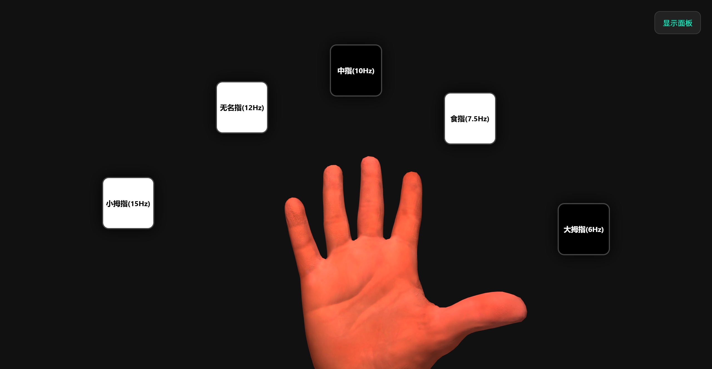

# SSVEP 三维手部模型课程项目文档

## 一、项目基本信息

**项目名称：** SSVEP 三维手部模型交互演示系统   
**核心内容：** 基于 Three.js 加载手部三维模型，实现手部姿态展示、左右手切换、骨骼调试以及基于 SSVEP 刺激块的手指动作模拟。

## 二、项目背景

本项目围绕手部三维模型可视化与交互控制展开，目标是构建一个可直接运行的网页端演示系统，用于展示手部模型的结构、骨骼层级与手指运动效果。项目同时引入 SSVEP 视觉刺激块交互形式，以便模拟不同手指动作的触发逻辑。

## 三、项目目标

本项目的主要目标如下：

1. 在网页端完成手部三维模型的加载与显示。
2. 支持左右手镜像切换，便于不同使用场景下的观察与演示。
3. 支持模型整体姿态校准，包括 X、Y、Z 三轴旋转调整。
4. 支持基于骨骼的单指弯曲动画控制。
5. 使用 SSVEP 刺激块模拟不同手指动作的触发与反馈。

## 四、项目实现概述

本系统采用原生 HTML、CSS 与 JavaScript 开发，使用 Three.js 作为三维渲染引擎，并通过 GLTFLoader 加载保存在 JS 文件中的手部模型数据。页面初始化后，系统会自动创建三维场景、相机、光照与渲染器，随后将手部 GLB 模型解析并显示在页面中心区域。

模型加载完成后，程序会自动遍历骨骼节点，根据骨骼名称提取大拇指、食指、中指、无名指和小拇指对应的关节数据。用户可通过页面上的调试面板完成以下操作：

- 切换左手或右手显示模式。
- 调整模型的整体旋转姿态。
- 指定手指弯曲时所采用的旋转轴与旋转方向。
- 显示或隐藏骨骼辅助线。

此外，页面中布置了五个不同频率的 SSVEP 刺激块，分别对应五根手指。点击刺激块后，可切换相应手指的弯曲与伸展状态，从而形成较为直观的交互演示效果。

## 五、项目功能说明

### 1. 三维模型加载

系统从 hand_model_data.js 中读取手部模型数据变量 HAND_GLB_BASE64，并由 GLTFLoader 进行解析。模型加载后自动完成缩放、居中与位置调整，以适配当前显示窗口。

### 2. 左右手镜像切换

通过对模型 X 方向缩放值进行镜像处理，实现右手与左手两种显示模式切换。同时，页面中的刺激块位置会根据手侧变化自动重新映射，以保持与手部显示方向一致。

### 3. 骨骼识别与动画控制

程序在模型遍历过程中自动识别手指骨骼，并按照不同手指的结构保留末端关键骨节。动画部分通过插值方式实现手指状态平滑过渡，避免突变。

### 4. 大拇指复合动作模拟

与其余四指不同，大拇指采用多轴复合旋转方式进行对掌动作模拟，以更贴近实际解剖运动特征。

### 5. SSVEP 刺激块交互

页面中设置了五个刺激块，分别标注不同频率，用于模拟与各手指对应的视觉刺激目标。点击刺激块后，可直接驱动相应手指动作变化，体现“刺激目标 - 手指响应”的交互逻辑。

## 六、静态预览图

下图为本项目页面生成的静态截图。

## 七、运行方式

### 1. 直接运行

在当前目录下使用浏览器打开 index.html，即可进入三维手部模型演示页面。

### 2. 推荐运行方式

为避免部分浏览器对本地资源加载存在限制，建议在当前目录启动本地静态服务器后再访问页面。

### 3. 运行条件

项目正常运行需满足以下条件：

- index.html 与 hand_model_data.js 位于同一目录。
- hand_model_data.js 中正确提供 HAND_GLB_BASE64 数据变量。
- 运行环境可以访问外部 CDN 资源，以加载 Three.js 与 GLTFLoader。
- 浏览器支持 WebGL。

## 九、使用说明

进入页面后，用户可根据需要完成如下操作：

1. 通过右上角调试面板切换左手或右手模式。
2. 通过滑块调整模型的三轴旋转角度，完成模型姿态校准。
3. 通过参数面板设置弯曲轴与弯曲方向。
4. 勾选“显示骨骼”观察手部骨骼结构。
5. 点击五个刺激块，分别控制不同手指完成弯曲或复位。

## 十、已知说明

1. hand_model_data.js 为模型数据文件，内容体量较大，主要用于承载三维模型，不适合按普通源码文件方式阅读。
2. 页面依赖外部 CDN，如果网络受限，可能导致 Three.js 相关资源加载失败。
3. 当前项目为原型演示版本，尚未接入真实的脑电采集或在线识别模块。

## 十一、总结

本项目完成了手部三维模型的网页端展示、骨骼识别、手指动作模拟与 SSVEP 刺激块交互等功能，具备较完整的课程项目展示形态。